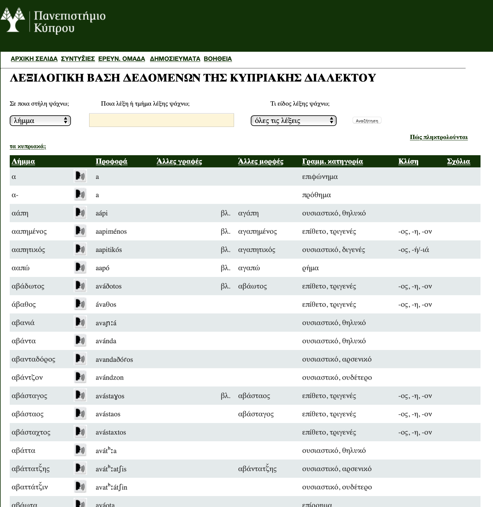

# [Online Cypriot Greek Dictionary](http://lexcy.library.ucy.ac.cy)

*Cypriot Greek Dictionary* is an online dictionary of  Cypriot Greek with text-to-speech, developed as part of the ‘Syntychies’ research program. You can search for specific words using basic regular expressions. The environment was written in C#.

<a href="http://lexcy.library.ucy.ac.cy">Visit Cypriot Greek Dictionary here.</a>

# Notes
The code is from 2011-2012 and has not changed ever since.

*Included in this Repo*
- The code for the side.

*Not Included in this Repo*
- The dictionary database (lexicon.mdb).
- The pronunciation sounds.

# Cite
Presented in EURALEX 2012 here: Themistocleous Charalambos Marianna Katsoyannou, Spyros Armosti, and Kyriaci Christodoulou (2012). Cypriot Greek Lexicography: A Reverse Dictionary of Cypriot Greek. Paper presented at the 15th European Association for Lexicography (EURALEX) Conference, Oslo, Norway, 7 – 11 August 2012.

[Link to the EURALEX paper:](http://euralex.org/wp-content/themes/euralex/proceedings/Euralex%202012/pp262-266%20Themistocleus,%20Katsoyannou,%20Armosti%20and%20Christodoulou.pdf)

[Link to the EURALEX software demonstration paper:](http://euralex.org/wp-content/themes/euralex/proceedings/Euralex%202012/pp889-891%20Themistocleus,%20Katsoyannou,%20Armosti%20and%20Christodoulou.pdf) Themistocleous Charalambos, Marianna Katsoyannou, Spyros Armosti, and Kyriaci Christodoulou (2012). Cypriot Greek Lexicography: An online lexical database. Paper presented at the 15th European Association for Lexicography (EURALEX) Conference, Oslo, Norway, 7 – 11 August 2012.